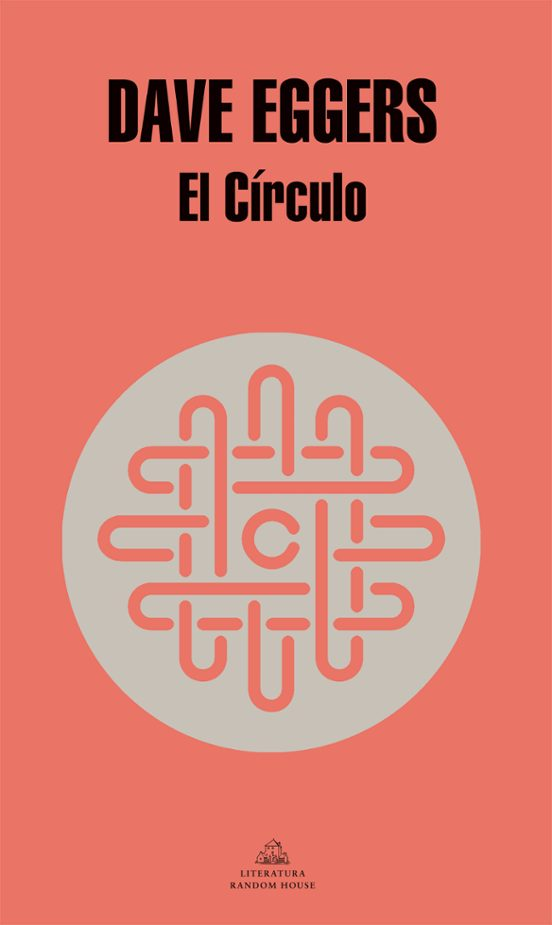

title: Novelas IT

# Novelas ambientadas en el mundo IT.

---

---

## **Mañana, mañana y mañana**

 

    
    

        <strong>Título:</strong> Mañana, mañana y mañana 
        <strong>Autor:</strong> Gabrielle Zevin 
        <strong>Editorial:</strong> Alianza Editorial 
        <strong>Año edición española:</strong> 2022 
        Publicación original: 2022  
                
        <strong>Reseña:</strong>
		<a href="https://www.nytimes.com/2022/07/08/books/review/tomorrow-and-tomorrow-and-tomorrow-gabrielle-zevin.html">New York Times</a>  
        
        Novela sobre la creación de un videojuego indie.
        Sigue a dos amigos que crean un videojuego que se convierte en un éxito, explorando la tecnología y la experiencia humana a lo largo de las décadas.
    

 

---

---

## **Valle inquietante**

 

    
    

        <strong>Título:</strong> Valle inquietante 
        <strong>Autor:</strong> Anna Wiener 
        <strong>Editorial:</strong> Libros del Asteroide 
        <strong>Año edición española:</strong> 2020 
        Publicación original: 2020  
        
		<strong>Reseña:</strong>
		<a href="https://www.nytimes.com/2020/01/03/books/review/uncanny-valley-anna-wiener.html">New York Times</a>  

        En 2013, con veinticinco años, Anna Wiener decide mudarse a San Francisco y fichar por una novedosa compañía de análisis de datos. 
        En el efervescente micromundo de Silicon Valley se codeará con jóvenes y entusiastas emprendedores 
        inmersos en una febril carrera hacia la innovación, la riqueza y el poder. 
    

 

---

## **The Adventures of an IT Leader**

 

    
    

        <strong>Título:</strong> The Adventures of an IT Leader 
        <strong>Autor:</strong> Robert D. Austin, Richard L. Nolan, Shannon O'Donnell 
        <strong>Editorial:</strong> Harvard Business Review 
        <strong>Año edición española:</strong> No disponible 
        Publicación original: 2016  
        
		<strong>Reseña:</strong>
		<a href="https://blogs.uoc.edu/informatica/es/las-aventuras-de-jim-barton/">UOC</a>  

A Jim Barton, nuevo CIO de la información y TIC, le previene su antecesor «Aquí no durarás un año».
Vive una crisis con caída de todos los sistemas, mentiras de los proyectos fallidos, 
trato con clientes internos y partners, preguntas metafísicas, o cómo manejar a los raros ingenieros TIC.
    

 

---

---

## **El círculo**

 

    
    

        <strong>Título:</strong> El círculo 
        <strong>Autor:</strong> Dave Eggers 
        <strong>Editorial:</strong> Random House 
        <strong>Año edición española:</strong> 2014 
        Publicación original: 2013  
        
		<strong>Reseña: </strong>
		<a href="https://www.theguardian.com/books/2013/oct/09/circle-dave-eggers-review">The Guardian</a>  

Mae Holland es contratada para trabajar en el Círculo, la empresa de internet más influyente del mundo.
A medida que Mae se adentra en la compañía, se va revelando una amenaza de un régimen totalitarista 
basado en la tecnología y la constante conectividad.
Novela de suspense sobre la invasión de la privacidad en la era de las redes sociales.
    

 

---

---

## **Reamde o El mundo a velocidad de vídeojuego**

 

    
    

        <strong>Título:</strong> Reamde o El mundo a velocidad de vídeojuego 
        <strong>Autor:</strong> Neal Stephenson 
        <strong>Editorial:</strong> Ediciones B 
        <strong>Año edición española:</strong> 2012 
        Publicación original: 2011  

		<strong>Reseña:</strong>
		<a href="https://www.theguardian.com/books/2011/oct/07/reamde-neal-stephenson-miller-review">The Guardian</a>  
       
Una novela tecno-thriller que involucra a jóvenes emprendedores en el mundo de los videojuegos online y la economía virtual.
    

 

---

---

## **JPod**

 

    
    

        <strong>Título:</strong> JPod 
        <strong>Autor:</strong> Douglas Coupland 
        <strong>Editorial:</strong> Quinteto 
        <strong>Año edición española:</strong> 2010 
        Publicación original: 2006  
        
		<strong>Reseña:</strong>
		<a href="https://www.theguardian.com/books/2006/may/21/fiction.douglascoupland">The Guardian</a> 
		<strong>Reseña:</strong>
		<a href="https://www.latimes.com/archives/la-xpm-2006-may-06-et-book6-story.html">Los Angeles Times</a>  

Ethan Jarlewski y sus cinco compañeros de trabajo conforman el jPOD, 
un grupo de programadores de videojuegos sometido a las directrices absurdas de una multinacional. 
Incapaces de rebelarse y limitados por el lenguaje logico y matematico de los ordenadores, 
sacrifican sus vidas privadas por el trabajo.
    

 

---

---

## **Microsiervos**

 

    
    

        <strong>Título:</strong> Microsiervos 
        <strong>Autor:</strong> Douglas Coupland 
        <strong>Editorial:</strong> Ediciones B 
        <strong>Año edición española:</strong> 1996 
        Publicación original: 1995  
        
Una novela que narra la vida cotidiana de un grupo de jóvenes programadores en Microsoft durante los años 90, 
capturando la cultura de las startups tecnológicas.
    

 

---

---
